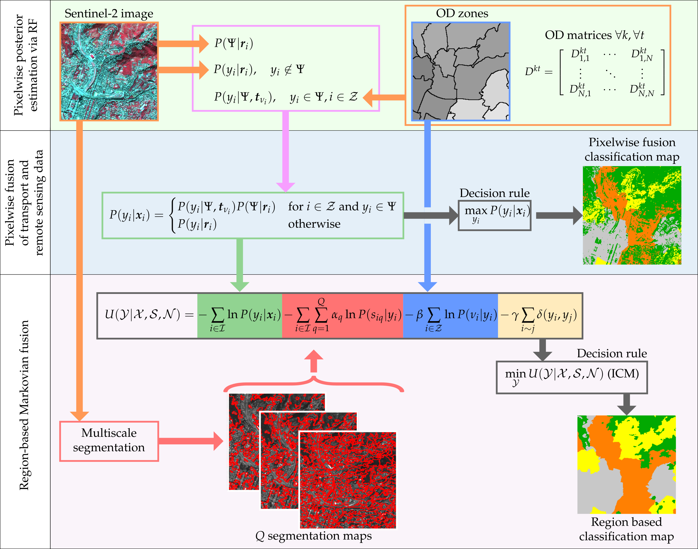

# Mobility demand and remote sensing fusion for land-use and land-cover mapping (dataset)

## Stay tuned for updates (and dataset release)!

(a) Proposed fusion methods for LULC mapping from mobility demand (OD data) and remote sensing (satellite imagery)

This repository contains the dataset related to the paper:  

M. Pastorino, F. Gallo, A. Di Febbraro, G. Moser, N. Sacco, and S. B. Serpico, ``Multimodal fusion of mobility demand data and remote sensing imagery for urban land-use and land-cover mapping," in Remote Sensing, 2022 [https://inria.hal.science/hal-04678650v1](https://www.mdpi.com/2072-4292/14/14/3370).

